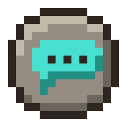
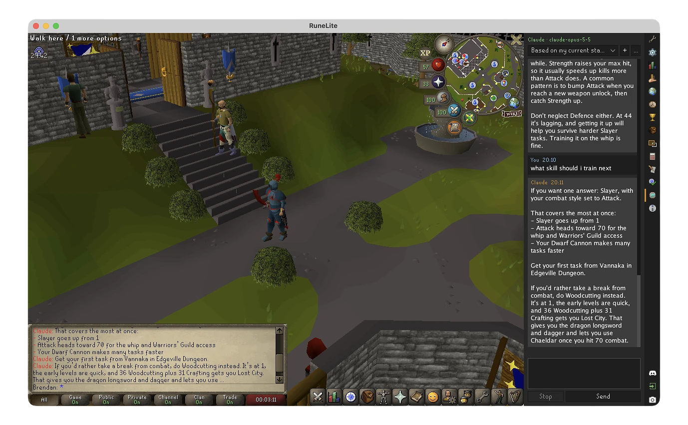

# AI Chat

Chat with Claude, ChatGPT or any OpenAI-compatible model without leaving Old School RuneScape: ask from a side panel
or the chatbox, keep playing, and get a game chat message and a notification when the answer is in. The assistant can
look things up on the OSRS Wiki while it answers. Uses your own API key. Free and open source.

## Features

- A chat panel in the RuneLite sidebar, with several chats side by side
- `::ai <message>` in the chatbox to ask without opening the panel (or `::ai` alone, or a hotkey you pick in the
  settings, to open an "Ask:" box); the line is handled by the plugin and isn't sent to the game
- Replies appear in the panel as they're written, with light formatting (lists, bold, links you can click); copy any
  message from its right-click menu. Once a reply is complete, it's echoed into the game chat, with a RuneLite
  notification
- **Wiki look-ups:** the assistant can search and read the OSRS Wiki and check Grand Exchange prices (from RuneLite's
  own price data) while it answers, and links the pages it used. What it looked up is listed under each reply.
  Look-ups need a model that can use tools; a model that can't (some that run on your own computer) answers from
  memory, and says so under its reply
- Pick your provider: **Claude** (Anthropic), **ChatGPT** (OpenAI), or any service with an **OpenAI-compatible** API,
  such as OpenRouter, Groq, or a free model running on your own computer with Ollama or LM Studio
- **Test** your setup from the panel, and choose a model from the ones you can use
- Optional, off by default: share your character (name, account type, levels and quests, and your Slayer task and
  achievement diaries when a question needs them), and your equipment, inventory and bank, for answers that fit your
  account
- The tokens each reply used, and the chat's total, with an estimate of the cost for Claude models
- A busy provider is asked again automatically; a question that failed or was stopped can be sent again with
  **Retry**, and what was shown of its reply stays for you to read
- Long chats are summarised instead of cut short (see [Long chats](#long-chats))

## Setup

1. Get an API key from your provider:
   - Claude: [console.anthropic.com](https://console.anthropic.com)
   - ChatGPT: [platform.openai.com](https://platform.openai.com)
   - OpenAI-compatible: from that service, or none for local ones like [Ollama](https://ollama.com) and
     [LM Studio](https://lmstudio.ai)

   API use is billed per message by the provider. A Claude or ChatGPT subscription doesn't include API access.
2. In RuneLite's settings, open **AI Chat**, turn on **Enable AI requests** and choose the **AI provider**. Then open
   that provider's section (Claude, ChatGPT or OpenAI-compatible) and paste your key. For an OpenAI-compatible
   service, also set its URL (for example `http://localhost:11434/v1` for Ollama) and model.
3. Open the AI Chat panel (the rune icon in the sidebar). Press **Test** to check your key and URL (some
   OpenAI-compatible services, such as OpenRouter, list their models for any key, so there only the URL is checked);
   if the model isn't one you can use, or you haven't set one yet, **Choose model...** lists the ones you can. Then
   ask away.

## Privacy

Nothing is sent anywhere until you turn on **Enable AI requests**, and turning it off stops anything already on its
way. Then everything goes straight from RuneLite to the provider you chose, and Wiki look-ups to the OSRS Wiki;
there's no server in between.

- **Sent to your AI provider with every message:** what you type, the earlier messages of that chat (in a long chat,
  a summary instead of the oldest ones; see [Long chats](#long-chats)), short instructions about the plugin (plus
  your own extra instructions, if you set any), and your IP address, as with any internet request. The chat so far
  goes to whichever provider is selected when you send, so switching providers mid-chat sends it to the new one.
- **What the assistant looks up** (Wiki pages, GE prices, and anything below that you share) is sent to the provider
  as part of the reply it's for. Claude also gets the look-ups of earlier replies again with each new message in that
  chat, while RuneLite stays open. Every look-up is listed under the reply it was for, such as "Read the Wiki page
  "Vorkath"" or "Shared your bank", so you can always see what was sent.
- **Only while "Send character info" is on:** your character name, account type (a regular account or which kind of
  ironman), combat and total level, skill levels, quest points, and which quests you've completed or started. Added to
  your first message in a chat and again when something changed (that message says "Sent your character details"; click
  it to see them), and sent along with the rest of that chat; turning the setting off leaves it out again. The assistant
  can also look up your current Slayer task (with your Slayer points and task streak) and which achievement diaries
  you've completed, when a question needs them.
- **Only while "Share items and gear" is on:** the assistant can look at your worn equipment, your inventory, and
  your bank as it was the last time you had it open while this setting was on (on the account you're logged in to),
  with Grand Exchange prices, when a question needs them. AI Chat keeps that last look at your bank in memory only,
  and only while this setting and AI Chat itself are on.
- Character, Slayer, diary and item look-ups only work while you're logged in.
- **Sent to the OSRS Wiki while "Wiki look-ups" is on (it is by default):** the search words and page titles the
  assistant looks up, and your IP address, go to oldschool.runescape.wiki. AI Chat adds nothing about your account,
  but the assistant writes the search words itself, from your question and anything you've shared with it, such as
  an item from your bank. Nothing from the Wiki is stored on your computer. GE prices come from the price list
  RuneLite already keeps, so checking one sends nothing anywhere.
- **Test** asks your provider which models your API key can use: it sends the key and your IP address, nothing else.
- **Never sent:** your account or login details, where you are in the game, what's around you, and anything about
  other players.
- **Your API key** is only sent to the provider it belongs to (never over plain `http://` to another computer on the
  internet). RuneLite keeps it with your other settings, unencrypted on your computer, and on RuneLite's servers if
  you use profile sync.
- **Chats** are kept on this computer in `.runelite/plugin-data/osrs-ai-chat/chats.json` (the latest 200 messages of
  each, and any older ones still sent to the assistant; see [Long chats](#long-chats)), so they're still there next
  time, including any character info that went with them, the list of what was looked up for each reply, and the tokens
  it used (the look-ups' contents aren't kept). Clear and Delete remove them from there too. Turn off **Remember chats**
  to keep chats only while RuneLite is open; that also deletes the saved copy. API keys are never saved there. With
  several RuneLite windows open, the first one remembers its chats and the others keep theirs only while open.
  Uninstalling AI Chat leaves the file: turn off **Remember chats** first, or delete the
  `.runelite/plugin-data/osrs-ai-chat` folder afterwards.
- **Notifications** say which assistant replied, not what you asked.

The provider's own privacy policy applies to what you send them, and the OSRS Wiki's to what goes there.

## Long chats

AI Chat never quietly drops the start of a chat. Once a chat would send more than 40 messages, it first asks the same
provider and model for a short summary of the oldest ones (one extra request, shown as "Summarising earlier
messages..."), then sends that summary instead of them, along with the newest 16 or so. A note just before your
question shows the summary, and the messages it covers say "(summarised)". If it couldn't be made, or you skip it (the Stop button says Skip while it's being made),
a note says so and the whole chat is sent that time; the next message tries again.

A chat can also be too long for the model with fewer messages: long replies and the Wiki pages read for them add up,
and smaller models take in less. When the provider says so, AI Chat summarises everything before your question and
asks once more; if it's still too long, start a new chat or choose a model that can take more. Ollama doesn't say so:
past the model's context size it quietly forgets the start of the chat, so raise that in Ollama for long chats.

**Remember chats** saves the latest 200 messages of each chat. Older ones are left out of the saved copy only once
they're no longer sent (the summary covers them, or they're notes and errors), and a note at the start of the chat
says how many are missing.

## Tokens and cost

Hover over the name above a reply to see the tokens it used, for example "1,204 in · 3,410 cached · 352 out · about
$0.01" (an error shows what its request used before it failed). When nothing is on its way, the line under the chat
shows the chat's total. It says "at least", without a cost, once a request in the chat was stopped or broke off part
way, since some of what it used was never counted, or when another Claude model finished a reply the first one
declined, since each is billed at its own prices. The cost is an estimate from Anthropic's published prices, for
Claude models only; your provider's bill is what counts.

## Settings

Each provider's settings are in its own section; only the one you picked is used.

| Setting | Default | |
|---|---|---|
| Enable AI requests | off | Nothing is sent until this is on |
| AI provider | Claude | Claude, ChatGPT, or OpenAI-compatible |
| Extra instructions | | Added to what the assistant is told, for example "I'm an ironman" |
| Wiki look-ups | on | Lets the assistant search and read the OSRS Wiki while it answers (see Privacy) |
| Claude API key / model | / `claude-opus-5-5` | Any Claude model, for example `claude-sonnet-5-5` or `claude-haiku-4-5` |
| ChatGPT API key / model | / `gpt-6-luna` | Any OpenAI chat model, for example `gpt-6.1-sol` |
| Compatible API URL / key / model | | The service's base URL (usually ending in `/v1`), key if it needs one, and model name |
| Thinking (OpenAI-compatible) | Short (faster) | How long a reasoning model thinks first; *Model default* leaves it to the service |
| Send character info | off | Name, account type, levels and quests with your messages; Slayer task and diaries when needed (see Privacy) |
| Share items and gear | off | Equipment, inventory and bank (as last seen) when needed (see Privacy) |
| Notify on reply | on | RuneLite notification when a reply arrives (enable *send when focused* to get it while playing) |
| Show replies in game chat | on | Echo replies into the chatbox |
| Chat reply length | 500 | Longer replies are cut short in the chatbox; the panel has everything |
| Ask hotkey | none | Opens an "Ask:" prompt in the chatbox |
| Remember chats | on | Keep chats when RuneLite closes (saved on this computer) |

Claude requests use Anthropic's prompt caching: the earlier part of a chat, sent again with every message, is read
from the cache at a fraction of the price. If Anthropic's safety filter declines a request, Anthropic retries it on
another Claude model (its server-side fallback) instead of refusing outright, where the model offers that. ChatGPT
and OpenAI-compatible models are asked to keep their reasoning short (reasoning effort "low"), which makes most
thinking models answer much faster; a model that doesn't support that is asked normally. A few models that don't
think by default will think a little; for those, set *Thinking* in the OpenAI-compatible section to *Model default*.

Independent project, not affiliated with or endorsed by Anthropic, OpenAI, Jagex or RuneLite. The assistant can't
control the game, and sees only what you choose to share (see [Privacy](#privacy)). BSD-2-Clause.
